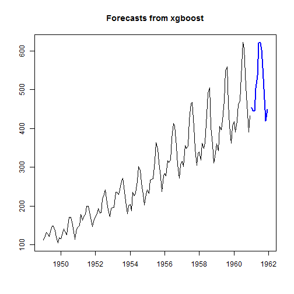
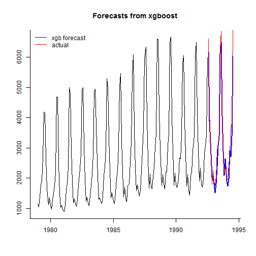

# forecastxgb-r-package
An R package for time series models and forecasts with xgboost compatible with {forecast} S3 classes

Only on GitHub.  Very early days, incomplete.  Planned addition is support for `xreg`.

This implementation uses as features lagged values of the target variable, linear time, and dummy variables for seasons.


```r
devtools::install_github("ellisp/forecastxgb-r-package/pkg")
```

## Usage


```r
library(forecastxgb)
model <- xgbts(AirPassengers)
```

```
## Starting cross-validation
```

```
## Stopping. Best iteration: 51
```

```
## Fitting xgboost model
```

```r
fc <- forecast(model, h = 12)
accuracy(fc)
```

```
##                        ME       RMSE        MAE           MPE       MAPE
## Training set 0.0009919484 0.06623895 0.04843864 -0.0004278004 0.01753102
##                     MASE       ACF1
## Training set 0.001512276 -0.1495159
```

```r
plot(fc)
```


## Tourism data example

```r
library(Tcomp)

thedata <- tourism[[1]]

x <-thedata$x
h <- thedata$h

model <- xgbts(x)
```

```
## Starting cross-validation
```

```
## Stopping. Best iteration: 18
```

```
## Fitting xgboost model
```

```r
summary(model)
```

```
## 
## Importance of features in the xgboost model:
##     Feature         Gain       Cover   Frequence
##  1:   lag12 8.017328e-01 0.364029143 0.172794118
##  2:   lag24 1.918308e-01 0.114029143 0.055147059
##  3:   lag18 1.013798e-03 0.038969841 0.040441176
##  4:   lag15 7.844374e-04 0.049559471 0.066176471
##  5:    time 7.167887e-04 0.052185700 0.058823529
##  6:    lag8 6.062073e-04 0.021772281 0.029411765
##  7:    lag1 4.475201e-04 0.041172484 0.110294118
##  8:    lag2 4.273998e-04 0.031853609 0.073529412
##  9:    lag6 4.100748e-04 0.019230769 0.040441176
## 10:    lag4 2.855101e-04 0.010928499 0.033088235
## 11:   lag20 2.644623e-04 0.035157574 0.033088235
## 12:   lag23 2.391372e-04 0.059047780 0.040441176
## 13:   lag11 2.330042e-04 0.022026432 0.025735294
## 14:    lag9 2.055025e-04 0.025160962 0.025735294
## 15:   lag21 1.567790e-04 0.013554727 0.018382353
## 16:    lag5 1.228351e-04 0.010928499 0.022058824
## 17:   lag16 1.120402e-04 0.012368689 0.022058824
## 18:    lag3 1.103278e-04 0.015333785 0.025735294
## 19:   lag13 8.942757e-05 0.021518129 0.014705882
## 20:   lag14 6.213436e-05 0.012199254 0.033088235
## 21:   lag19 5.986010e-05 0.010928499 0.022058824
## 22:   lag17 3.230729e-05 0.002710945 0.007352941
## 23:   lag10 2.104655e-05 0.007031515 0.011029412
## 24: season3 2.042869e-05 0.005167740 0.003676471
## 25:    lag7 1.295809e-05 0.002033209 0.011029412
## 26:   lag22 2.435382e-06 0.001101322 0.003676471
##     Feature         Gain       Cover   Frequence
## 
##  36 features considered.
## 163 original observations.
## 139 effective observations after creating lagged features.
```

```r
fc <- forecast(model, h = h)
plot(fc, bty = "l")
lines(thedata$xx, col = "red")
legend("topleft", legend = c("xgb forecast", "actual"), lty = 1, col = c("blue", "red"), bty ="n")
```



```r
accuracy(fc, thedata$xx)
```

```
##                      ME      RMSE       MAE       MPE      MAPE      MASE
## Training set   9.443368  30.26095  20.57932 0.2722262 0.8535777 0.1082913
## Test set     247.664745 383.39113 291.86403 6.7443169 8.8075372 1.5358296
##                      ACF1 Theil's U
## Training set -0.008168322        NA
## Test set      0.110661922 0.4039669
```

## Non-seasonal data


```r
obj <- xgbts(Nile)
```

```
## Starting cross-validation
```

```
## Stopping. Best iteration: 11
```

```
## Fitting xgboost model
```

```r
xgbts_importance(obj)
```

```
##    Feature       Gain      Cover  Frequence
## 1:    time 0.30503595 0.13156566 0.06711409
## 2:    lag1 0.19941513 0.20075758 0.18120805
## 3:    lag6 0.15796942 0.12651515 0.16107383
## 4:    lag4 0.10118920 0.16590909 0.10738255
## 5:    lag2 0.06530652 0.11262626 0.12751678
## 6:    lag8 0.06015847 0.10479798 0.09395973
## 7:    lag5 0.04952597 0.05606061 0.10067114
## 8:    lag3 0.04153827 0.05833333 0.09395973
## 9:    lag7 0.01986107 0.04343434 0.06711409
```

```r
fc <- forecast(obj, 30)
plot(fc, bty = "l")
```



